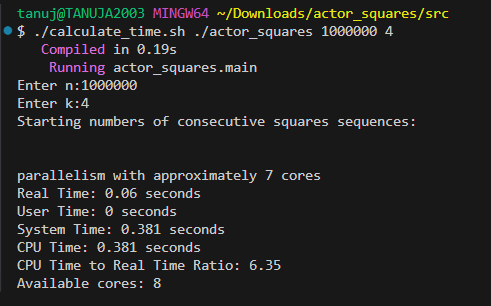
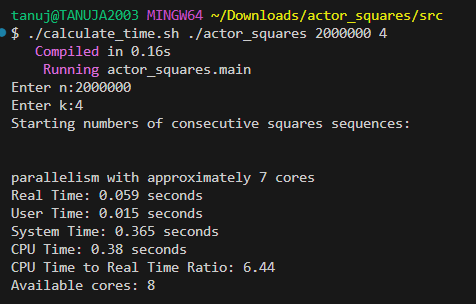

# COP5615 Project 1

## Team Members

- *Tanuja Naga Sai Palapati*  
  - UFID: 89475480

- *Venkata Nitchaya Reddy Konkala*  
  - UFID: 34102083

## GitHub Repository

[GitHub Link](https://github.com/Nitchaya-Reddy/COP5615-DOSP-Project-1)

# Project Description

This project showcases how the actor model in Gleam can be used to break down a computational task and process it in parallel. The specific problem tackled is finding all starting numbers of consecutive square sequences of length k whose total sum is itself a perfect square.

To solve this, the range [1..n] is split into smaller segments, each assigned to a worker actor. A central boss actor oversees the workers, gathers their results, and sends them back to the main process.

# Overview

The system consists of three primary components:

*Main Program (actor_squares.gleam)* – Handles input, launches the boss actor, and prints the final results.

*Boss Actor (boss.gleam)* – Responsible for distributing tasks and collecting results.

*Worker Actor (worker.gleam)* – Processes assigned ranges and checks if the computed sums are perfect squares.

This architecture enables true parallel execution across multiple CPU cores.

# Actors and Functionality

# Boss Actor

*Role:* Oversees the entire computation. It breaks the overall task into parts, assigns these to worker actors, and gathers the results.

# Message Types:

*InitializeSearch* – Initiates the computation with n, k, and the specified work unit size.

*PartialResults* – Contains partial results from a worker.

*WorkerFinished* – Indicates that a worker has completed its assigned task.

*Terminate:* Once all workers have completed, the boss sends the full list of results back to the main process.

# Worker Actor

*Purpose:* Handles a specific range of starting numbers.

# Behavior:

Iterates through its assigned range.

Calculates the sum of k consecutive squares starting at each number.

Checks if that sum is a perfect square.

Returns any valid starting numbers to the boss.

# Main Program

Reads the input values (n, k).

Calls boss.find_all_sums(n, k, unit_size).

Displays any valid starting numbers received.

Serves as a client that waits for results from the boss.

# Work Unit Size

We tested various unit sizes, each defining how many subproblems a single worker should process.

*Too small:* Results in too many workers, increasing communication overhead.

*Too large:* Reduces parallelism due to fewer active workers.

Through testing, a unit size of 650 struck the best balance—minimizing communication while maximizing concurrency.

# Performance Evaluation

*Execution time was measured using the calculate_time.sh script, which logs:*

Real time
User time
System time
CPU time to real time ratio
Available cores

*parallelism with approximately* 7 cores

*Sample Run* – ./calculate_time.sh ./actor_squares 1000000 4

*Real Time:* 0.045 seconds

*User Time:* 0.015 seconds

*System Time:* 0.35 seconds

*CPU Time:* 0.365 seconds

*CPU/Real Ratio:* 8.11

*Cores Available:* 8

**Output** 

**Solution for gleam run 1000000 4 does not exist**

# Largest Problem Solved

The implementation was successfully tested on a maximum input size of:

n = 2,000,000, k = 4

For values beyond this, execution times became too long for practical use.

**Output** 

# Performance Optimization

*Tuned Unit Size:* A unit size of 650 was determined to be the most efficient.

*Effective Concurrency:* Worker actors operate independently and complete at different times, ensuring cores remain active.

*Reduced Messaging Overhead:* Workers send results in batches rather than reporting individual findings, improving efficiency.
